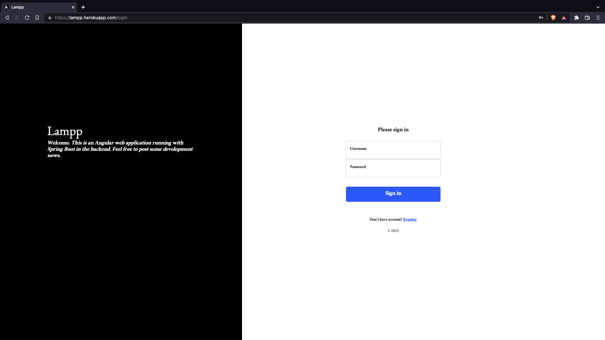
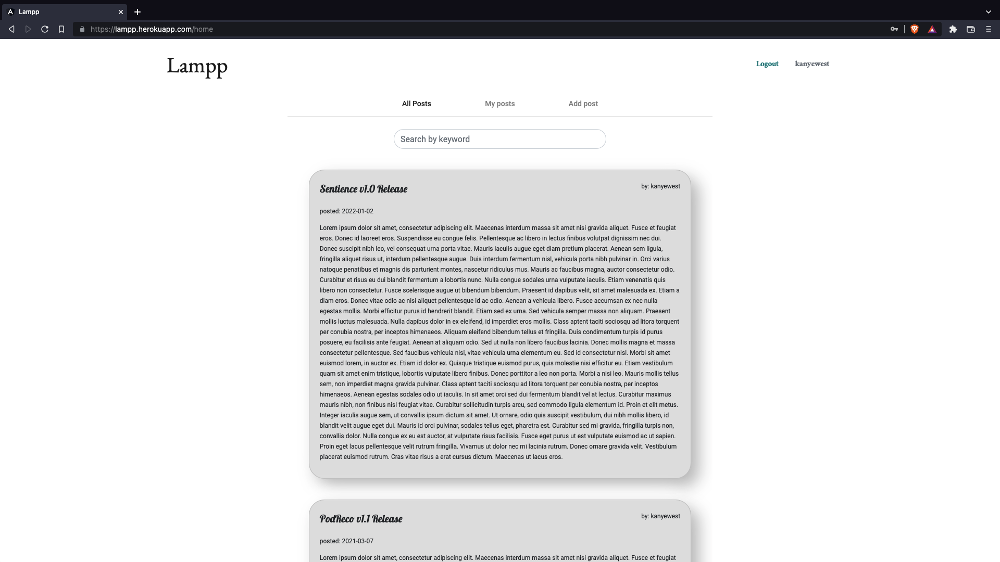
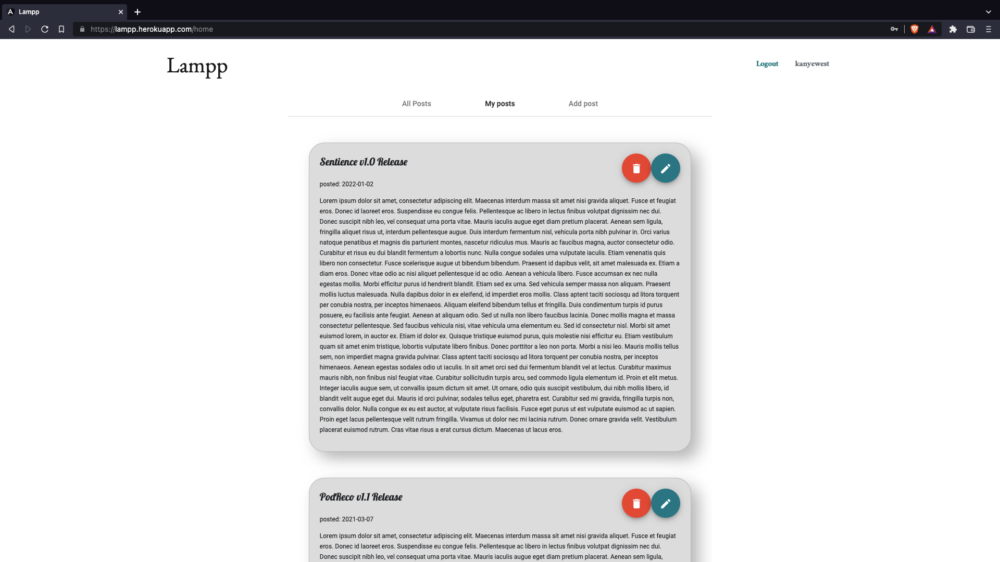
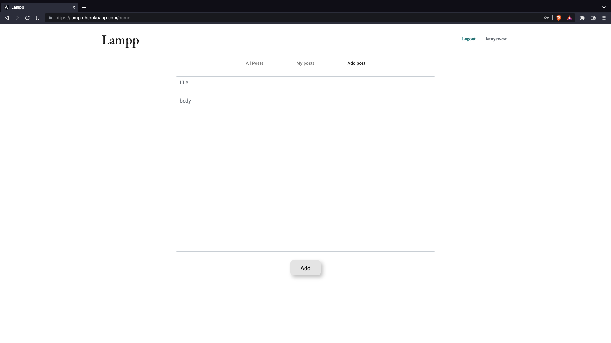

# Lampp
An Angular web application running with Spring Boot for security and REST APIs. Users can add posts about their software news and releases.

## Technologies
* [Spring Boot](https://docs.spring.io/spring-boot/docs/current/reference/htmlsingle/)
* [Java](https://docs.oracle.com/en/java/)
* [HTML](https://www.w3schools.com/TAgs/default.asp)
* [CSS](https://www.w3schools.com/css/default.asp)
* [JavaScript](https://www.w3schools.com/js/default.asp)
* [Google Fonts](https://fonts.google.com/)
* [MySQL](https://dev.mysql.com/doc/)
* [H2 Database](https://www.h2database.com/html/main.html)
* [Angular](https://angular.io/docs)

## Screenshots

## Room for improvement
* UX/UI can be improved (ie. mobile, typography, color palette)
* Cloud storage integration (ie. Firebase Storage) can be integrated to store images instead of plain text on posts
